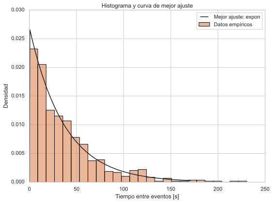

# Modelos probabilísticos para los tiempos entre eventos

En esta sección se ajustan modelos de probabilidad a la variable **tiempos entre datos**, definida anteriomente como:

\[
T_i = t_i - t_{i-1}.
\]

El objetivo es determinar qué distribución describe mejor el comportamiento del proceso del cual se recolectaron los datos.

## Cálculo de los tiempos entre eventos

Los datos originales consisten en _timestamps_ almacenados en una base de datos.
El script utiliza la función `load_time_between_data()` para:

1. Leer los _timestamps_ en orden ascendente.
2. Convertirlos a tipo `datetime`.
3. Calcular las diferencias consecutivas \(T_i\) en segundos.
4. Eliminar el primer valor (que es `NaN`).

## Pruebas de bondad de ajuste

Para cumplir con los requerimientos del curso, la selección del modelo no se realiza por inspección visual, sino mediante **pruebas de bondad de ajuste**, implementadas con el paquete `Fitter` de Python.
En el programa, se utilizó la función `fit_candidate_distributions()` que evalúa automáticamente un conjunto amplio de distribuciones:

- Exponencial
- Gamma
- Lognormal
- Weibull
- Normal
- Cauchy
- Chi-cuadrado
- Rayleigh
- Distribución uniforme
- _Power Law_
- Entre otras.

!!! info "Algoritmo interno de `Fitter`"

    `Fitter` ajusta cada distribución por **Máxima Verosimilitud (MLE)** y compara con el histograma usando SSE (suma del error cuadrático).

## Resultado del ajuste

!!! success "Mejor modelo obtenido"

    La distribución **exponencial** fue la que mejor se ajustó a los datos.
    Presentó un error \(SSE = 0.000285\), menor que todas las demás distribuciones probadas.

Los parámetros estimados fueron:

| Parámetro | Valor |
|----------:|------:|
| `loc`     | 0.006002 s |
| `scale`   | 37.099344 s |
| \(\lambda = 1/\text{scale}\) | 0.026955 s\(^{-1}\) |

La PDF del modelo seleccionado resultó en la expresión a continuación con parámetro \(\lambda = 0.02695\):

\[
f(x, \lambda) =
\begin{cases}
\lambda\, e^{-\lambda x}, & x \ge 0 \\
0, & x < 0.
\end{cases}
\]

## Momentos teóricos del modelo exponencial

Una vez seleccionado el modelo, se implementó la función `compute_model_moments()`, para obtener los momentos teóricos directamente con `scipy.stats`.
Los momentos teóricos obtenidos a partir del modelo se resumen en la tabla a continuación:

| Momento | Expresión teórica | Valor obtenido |
|--------:|----------:|----------------:|
| Media | `loc` + `scale` | 37.1053 s |
| Varianza | \(1/\lambda^2\) | 1376.36 s\(^2\) |
| Desviación estándar | \(1/\lambda\) | 37.0993 s |
| Inclinación | \(2\) | 2.0 |
| Kurtosis | \(6\) | 6.0 |

!!! note "Análisis breve"

    Los momentos teóricos del modelo coinciden significativamente con los momentos empíricos, lo cual refuerza la validez de seleccionar la distribución exponencial como modelo del proceso.

## Gráfica del modelo ajustado

A continuación, se presenta el histograma experimental junto con la densidad de probabilidad del modelo seleccionado:

  
  
Figura 2. Histograma de los tiempos entre eventos con el modelo exponencial ajustado.

!!! abstract "Interpretación de la gráfica"

    - La curva exponencial se ajusta adecuadamente en la región de alta densidad (cercana a cero).
    - La forma general confirma la similitud del modelo **exponencial**, consistente con el proceso de Poisson analizado.

